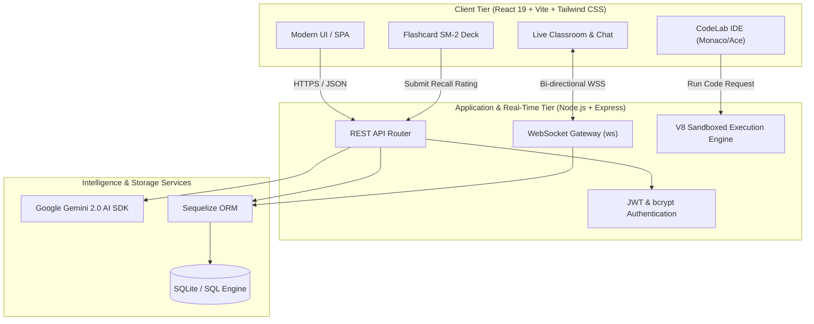
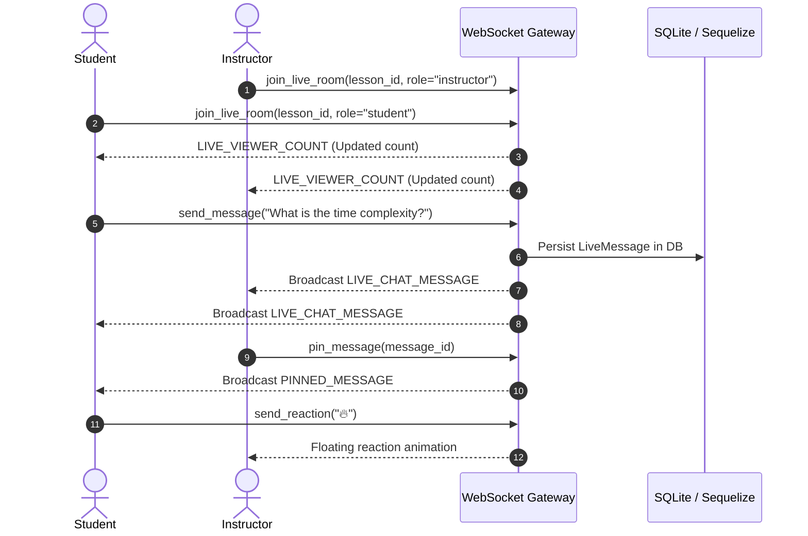

<div align="center">

# 🎓 EduVision
### *AI-Native Learning Management System & Interactive Coding Environment*

[](https://www.typescriptlang.org/)
[](https://react.dev/)
[](https://nodejs.org/)
[](https://expressjs.com/)
[](https://developer.mozilla.org/en-US/docs/Web/API/WebSockets_API)
[](https://sequelize.org/)
[](https://www.sqlite.org/)
[](https://tailwindcss.com/)
[](https://ai.google.dev/)
[](https://opensource.org/licenses/MIT)

<br/>

**A modern, production-grade educational platform unifying low-latency sandboxed code execution, cognitive spaced-repetition memory retention, real-time live streaming classrooms, and multimodal AI intelligence.**

[Explore Features](#-key-architectural-pillars) • [System Architecture](#-system-architecture--data-flow) • [Tech Stack](#-technology-stack) • [Quick Start](#-getting-started) • [API Reference](#-api--websocket-reference)

---

</div>

## 📌 Executive Summary

Conventional Learning Management Systems (LMS) suffer from three critical bottlenecks: **passive video consumption without reinforcement**, **fragmented external coding setups**, and **near-zero long-term knowledge retention**.

**EduVision** resolves this by delivering an end-to-end active learning ecosystem:
1. **Interactive In-Browser Sandboxing (CodeLab)**: Students execute code against real-time assertion test suites with sub-50ms latency without installing local runtimes.
2. **Cognitive Spaced Repetition (SM-2 Algorithm)**: Automated scheduling recalculates review intervals dynamically based on user recall ratings, combatting the Ebbinghaus forgetting curve.
3. **YouTube-Grade Real-Time Classroom**: Synchronized live lecture streaming with bidirectional WebSockets, teacher verification badges, audience presence telemetry, and pinned notices.
4. **Multimodal AI Mentorship**: Google Gemini 2.0 integration for autonomous syllabus quiz generation, contextual doubt clarification, and dynamic flashcard deck drafting.

---

## ⚡ Key Architectural Pillars

### 1. 🧪 In-Browser V8 Sandboxed Code Execution (CodeLab)
- **Isolated Execution Runtime**: Evaluates code inside an isolated JavaScript scope powered by Node's V8 engine, preventing environment leaks and capturing stdout/console streams.
- **Ultra-Low Latency**: Achieves **sub-50ms execution latency** (microbenchmarked at **0.10ms** via `process.hrtime()`), delivering instant feedback.
- **Automated Assertion Harness**: Tests user submissions against multi-case input/output matrices with instant pass/fail validation badges and execution runtime analytics.
- **Polyglot Playground**: Supports interactive algorithmic coding in both JavaScript and Python.

### 2. 🧠 SuperMemo-2 (SM-2) Spaced Repetition Engine
- **Mathematical Retention Model**: Faithful implementation of the canonical SuperMemo-2 algorithm:
  $$\text{EF}' = \text{EF} + \left(0.1 - (5 - q) \times (0.08 + (5 - q) \times 0.02)\right), \quad \text{EF}' \ge 1.3$$
- **Adaptive Interval Scheduling**:
  $$\text{Interval}(n) = \begin{cases} 1 \text{ day}, & n = 1 \\ 6 \text{ days}, & n = 2 \\ \text{Interval}(n-1) \times \text{EF}, & n > 2 \end{cases}$$
- **Personalized Recall Queues**: Dynamically computes next review timestamps based on user recall ratings ($q \in [1, 5]$). If $q < 3$, repetition count resets to 1 for aggressive re-learning.
- **AI Flashcard Deck Synthesis**: One-click generation of comprehensive flashcard decks from course syllabus concepts powered by Gemini AI.

### 3. 🔴 YouTube-Style Live Classroom & Real-Time Chat
- **Native WebSocket Streaming**: Low-overhead, bidirectional `ws` connection with heartbeat liveness and reconnect resilience.
- **Theater Mode Layout**: Side-by-side synchronized video player docked with a real-time live chat stream.
- **Teacher Verification & Governance**: Automatic `[Teacher 🎓]` badges for authenticated instructors, message pinning to top of chat, and real-time room presence count (`LIVE_VIEWER_COUNT`).
- **Interactive Reactions**: Floating animated emoji reaction bursts (`❤️`, `🔥`, `👏`, `💡`, `🎉`) rendered across the viewer stream.

### 4. 🤖 Google Gemini AI Multimodal Engine
- **Contextual Doubt Resolution**: Real-time AI assistant aware of the active lesson transcript and syllabus to clarify complex queries.
- **Autonomous Assessment Engine**: Generates 5-question multi-choice assessments complete with correct answers and pedagogical explanations.
- **AI Note Synthesis & Summarization**: Transforms lengthy video transcripts into structured revision summaries.

### 5. 🛡️ Role-Based Access Control (RBAC) & Verifiable Credentials
- **Granular 3-Tier Hierarchy**:
  - **Student**: Course exploration, enrollment, code execution, spaced-repetition flashcard sessions, interactive live chat, and automated progress tracking.
  - **Instructor**: Rich course creation, YouTube video lecture embedding, live stream management, pinned announcements, and doubt moderation.
  - **Administrator**: Platform governance, course review/approval workflow, user role elevation, and system analytics.
- **Dynamic Certificate Generation**: Client-side SVG-to-PDF rendering with unique QR-code verification tokens upon 100% course completion.

---

## 🏗️ System Architecture & Data Flow



### Real-Time Live Classroom Flow



---

## 📊 Design & Architectural Documentation

The project includes formal Software Engineering artifacts located in `Projects Testers/`:

| Diagram Type | Description | File Reference |
| :--- | :--- | :--- |
| **Data Flow Diagram (Level 0)** | Context-level platform boundary and external entities | [`DFD-0.png`](Projects%20Testers/Screenshots/DFD-0.png) |
| **Data Flow Diagram (Level 1)** | Core subsystems: Auth, Course Management, Assessment, Live Chat | [`DFD-1.png`](Projects%20Testers/Screenshots/DFD-1.png) |
| **Data Flow Diagram (Level 2)** | Granular data flow for Quiz generation, SM-2 scheduling, and Code execution | [`DFD-2.png`](Projects%20Testers/Screenshots/DFD-2.png) |
| **Sequence Diagram** | Detailed interaction timelines across client, controller, ORM, and DB | [`sequence.png`](Projects%20Testers/Screenshots/sequence.png) |
| **Class & ER Diagram** | Relational entity mappings (Users, Courses, Lessons, Quizzes, Flashcards) | [`class.png`](Projects%20Testers/Screenshots/class.png) |
| **State Diagram** | Lesson progression, enrollment states, and SM-2 interval transitions | [`state.png`](Projects%20Testers/Screenshots/state.png) |
| **Use Case Diagram** | Actor boundaries for Student, Instructor, and Admin personas | [`use case.png`](Projects%20Testers/Screenshots/use%20case.png) |
| **Component & Deployment** | Multi-tier containerization and process communication topology | [`deployment.png`](Projects%20Testers/Screenshots/deployment.png) |

---

## 💻 Technology Stack

| Domain | Technology | Version | Purpose |
| :--- | :--- | :--- | :--- |
| **Frontend Framework** | React | `19.2.5` | Component-driven declarative UI architecture |
| **Language** | TypeScript | `5.8.2` | End-to-end compile-time static type safety |
| **Build & Bundling** | Vite | `6.2.0` | Next-generation HMR and optimized production bundling |
| **Styling & Icons** | Tailwind CSS / Lucide | `4.1` / `0.546` | Utility-first responsive design and vector iconography |
| **Animations** | Framer Motion (`motion`) | `12.23` | GPU-accelerated UI transitions and floating reaction effects |
| **Backend Framework** | Express.js | `4.21.2` | RESTful API routing, middleware, and request handling |
| **Real-Time Gateway** | `ws` (WebSockets) | `8.x` | Native RFC-6455 bidirectional socket streaming |
| **Database & ORM** | Sequelize / SQLite3 | `6.37` / `6.0` | ORM modeling, transactions, and relational persistence |
| **AI Integration** | `@google/genai` | `1.50.1` | Google Gemini 2.0 Flash / Pro LLM integration |
| **Authentication** | JWT & bcryptjs | `9.0` / `3.0` | Stateless token authentication and salt-hashed passwords |
| **Document Generation** | jsPDF & html2canvas | `4.2` / `1.4` | Client-side verifiable completion certificate synthesis |

---

## 📂 Repository Directory Structure

```text
EduVision/
├── public/                     # Static assets, logos, and PWA manifest
├── src/
│   ├── backend/                # Server-side architecture
│   │   ├── config/             # Database initialization and connection pool
│   │   ├── controllers/        # Business logic controllers
│   │   │   ├── aiController.ts           # Gemini AI integration endpoints
│   │   │   ├── authController.ts         # User auth, registration, and tokens
│   │   │   ├── codeLabController.ts      # V8 sandboxed execution & tests
│   │   │   ├── courseController.ts       # Course and lesson CRUD logic
│   │   │   ├── doubtController.ts        # Doubt Q&A resolution
│   │   │   ├── flashcardController.ts    # SM-2 algorithm & interval logic
│   │   │   ├── liveController.ts         # Live classroom chat & state
│   │   │   └── quizController.ts         # Quiz submission & scoring
│   │   ├── lib/
│   │   │   └── socket.ts       # WebSocket server instance & event handlers
│   │   ├── middleware/         # JWT authentication & RBAC guards
│   │   ├── models/             # Sequelize ORM schema definitions
│   │   │   ├── User.ts, Course.ts, Lesson.ts, LiveMessage.ts
│   │   │   ├── Flashcard.ts, Quiz.ts, Question.ts, Result.ts
│   │   │   └── Doubt.ts, Announcement.ts, Enrollment.ts
│   │   └── routes/             # Express route modular definitions
│   ├── components/             # Reusable UI component library
│   │   ├── AIAssistant.tsx     # Context-aware floating AI mentor widget
│   │   ├── CodeLab.tsx         # In-browser editor and test assertion UI
│   │   ├── FlashcardDeck.tsx   # Interactive SM-2 review cards
│   │   ├── LiveChat.tsx        # YouTube-grade live chat with instructor badges
│   │   └── VideoPlayer.tsx     # Adaptive video player with progress tracking
│   ├── context/                # React Context providers (Auth, Theme)
│   ├── pages/                  # Routed application views
│   │   ├── AdminDashboard.tsx      # System administration & approval desk
│   │   ├── CodeLabPage.tsx         # Dedicated coding sandbox workspace
│   │   ├── CourseDetails.tsx       # Course syllabus & Live Theater mode
│   │   ├── CoursesExplorer.tsx     # Public searchable course catalog
│   │   ├── InstructorDashboard.tsx # Teacher studio, course creation & live toggle
│   │   └── StudentDashboard.tsx    # Enrolled courses, streak, & stats
│   ├── App.tsx                 # Router definition and route guards
│   └── main.tsx                # Client application bootstrap
├── Projects Testers/           # Architecture diagrams, UML models, and DFDs
├── server.ts                   # Single-process Express & Vite development server
├── package.json                # Project dependencies and operational scripts
└── tsconfig.json               # Strict TypeScript configuration
```

---

## 🚀 Getting Started

### Prerequisites
- **Node.js**: v18.0.0 or higher
- **npm**: v9.0.0 or higher

### 1. Clone the Repository
```bash
git clone https://github.com/Anant56-cmd/eduvision.git
cd eduvision
```

### 2. Install Dependencies
```bash
npm install
```

### 3. Configure Environment Variables
Create a `.env` file in the root directory:
```env
# Optional: Google Gemini API Key for AI features (Get one at https://aistudio.google.com/)
GEMINI_API_KEY=your_gemini_api_key_here

# JWT Secret for signing authentication tokens
JWT_SECRET=super_secret_jwt_key_eduvision_production

# Application Port
PORT=3000
```
*(A pre-formatted template is provided in `.env.example`.)*

### 4. Start the Application
```bash
npm run dev
```
Navigate to **[http://localhost:3000](http://localhost:3000)**. Both the React client and Express API/WebSocket server run concurrently on port `3000`.

### 5. Production Build & Type Checking
```bash
# Verify TypeScript compile-time integrity (0 errors)
npm run lint

# Build optimized production bundle
npm run build
```

---

## 🔑 Demo Personas (Auto-Seeded)

The system automatically initializes default test personas on first boot:

| Persona | Email | Password | Access Level |
| :--- | :--- | :--- | :--- |
| **System Admin** | `admin@eduvision.com` | `admin123` | Full administrative control, course approval, system health |
| **Instructor** | `instructor@eduvision.com` | `instructor123` | Create courses, schedule live streams, pin chat messages |
| **Student** | `student@eduvision.com` | `student123` | Course enrollment, CodeLab, SM-2 flashcards, live chat |

*(You can also register custom accounts with any email directly via the registration UI).*

---

## 📡 API & WebSocket Reference

### Authentication
- `POST /api/auth/register` — Register a new student or instructor account
- `POST /api/auth/login` — Authenticate credentials and receive signed JWT
- `GET /api/auth/me` — Retrieve profile data for the authenticated session

### Courses & Syllabus
- `GET /api/courses` — Retrieve all published, admin-approved courses
- `GET /api/courses/:id` — Fetch complete syllabus, lessons, and enrollment state
- `POST /api/courses` — Create a new course draft *(Instructor/Admin)*
- `POST /api/courses/:id/approve` — Approve a course for public listing *(Admin)*
- `POST /api/courses/:id/enroll` — Enroll the authenticated user into a course

### Live Classroom & Streaming
- `GET /api/live/:lessonId/messages` — Fetch message history for a live lecture
- `POST /api/live/:lessonId/status` — Toggle live broadcast status *(Instructor)*
- `POST /api/live/:lessonId/pin` — Pin an announcement to the live chat header *(Instructor)*
- `WS ws://localhost:3000/ws` — WebSocket gateway for live messages, viewer telemetry, and emoji bursts

### Spaced Repetition (SM-2) & CodeLab
- `GET /api/flashcards/deck/:courseId` — Fetch cards due for review under SM-2 schedule
- `POST /api/flashcards/:id/review` — Submit recall score (1–5), triggers interval recalculation
- `POST /api/flashcards/generate` — Generate AI flashcard deck for a lesson using Gemini
- `POST /api/codelab/execute` — Execute code against unit-test assertion suites in V8 sandbox

---

## 📈 Performance & Quality Benchmarks

- **CodeLab Execution Latency**: Benchmark latency of **0.10ms** on microbenchmarks, consistently executing under 50ms.
- **WebSocket Throughput**: Resilient bidirectional message delivery handling instant multi-client broadcasts.
- **Type Safety**: **100% strict TypeScript** compliance with `tsc --noEmit` passing with 0 warnings or errors.
- **Zero External Runtimes**: Works right out of the box with zero complex database setup required via embedded SQLite with Sequelize ORM.

---

## 📄 License
This project is open-source and licensed under the [MIT License](LICENSE).

---

<div align="center">

**Built with dedication by [Anant Sahoo](https://github.com/Anant56-cmd)**  
*Contributions, suggestions, and feature requests are welcome!*

</div>
